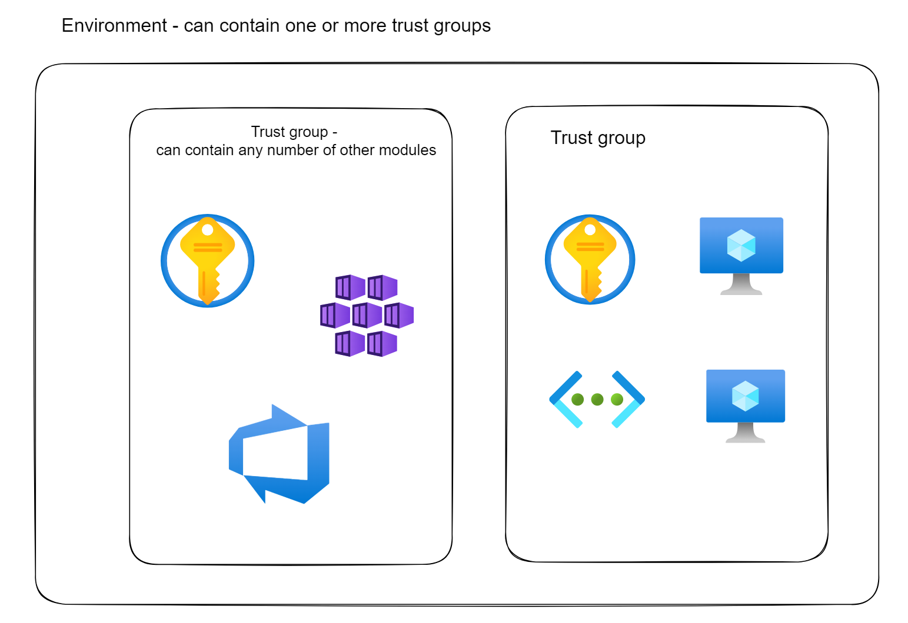

# What is Curtain Wall?

Curtain Wall is a lightweight framework produced by Microsoft for provisioning resources in Azure with Terraform. It focuses on the provisioning of private self-managed Azure resources for the creation of DevSecOps platforms and work-flows. It is comprised of a set of reusable Terraform modules designed to be used together, that stand-up different services and capabilities, and helps integrate them with Azure DevOps.

Curtain Wall is intended to make it easy to on-board new users to working with Terraform rather than abstracting them away from it. The modular service-oriented structure enables software factory infrastructure designs to be modelled in terms of their architecture, rather than at a low level. The modules provide a simple common interface for provisioning resources and services, and help ensure required security and operations tooling are consistently and correctly installed and configured. The modules can be stored remotely in Git and reused by multiple Terraform configurations.

# How to get started - CodeGen.Py

First you need to set up a new Terraform environment. Use the module `blank-env-copy-me` for this in the following way:

1. Install pre-requisites
   To do this, run: 
   
   `pip install -r codegen/requirements.txt`

2. Copy/paste the template folder and rename it to the new environment name.
   In powershell, this is: 
   
   `Copy-Item .\blank-env-copy-me\ c:\whatever\newenv -Recurse`
   
   In this new environment folder you should see the following files:
   - .azdo/ci-pipeline.yaml
   - .gitignore
   - dev_override.tf
   - migrate_state.ps1
   - migrate_stash.sh
   - README.md
   - terraform.tf
   - variables.tf

3. Set your environment variables:

```pwsh
$env:CURTAIN_WALL_MODULES_HOME = "C:\{path}\Curtain-Wall-Modules"
$env:CURTAIN_WALL_ENVIRONMENT = "C:\Users\{user}\{path for wherever your new environment is}"
$env:CURTAIN_WALL_USE_MLD = True
```

4. At the Curtain Wall Modules level run:

`python codegen/src/codegen.py create -g {resource group name}`

This will add config and terraform files to your environment needed for the base layer of Curtain Wall.

You can then add other modules to your environment with the command:

`python codegen/src/codegen.py add -m {module you want to add} -g {resource group name}`


5. Confirm the values in the dev.tfvars and .env/.env.ps1 for this new environment to reflect your azdo org and secrets.

# How to get started - Builder.Py

First you need to set up a new Terraform environment. Use the module `blank-env-copy-me` for this in the following way:

1. Install pre-requisites
   To do this, run: 
   
   `pip install -r codegen/requirements.txt`

2. Copy/paste the template folder and rename it to the new environment name.
   In powershell, this is: 
   
   `Copy-Item .\blank-env-copy-me\ c:\whatever\newenv -Recurse`
   
   In this new environment folder you should see the following files:
   - .azdo/ci-pipeline.yaml
   - .gitignore
   - dev_override.tf
   - migrate_state.ps1
   - migrate_stash.sh
   - README.md
   - terraform.tf
   - variables.tf

3. Set your environment variables:

```pwsh
$env:CURTAIN_WALL_MODULES_HOME = "C:\{path}\Curtain-Wall-Modules"
$env:CURTAIN_WALL_ENVIRONMENT = "C:\Users\{user}\{path for wherever your new environment is}"
$env:CURTAIN_WALL_USE_MLD = True
```

4. The `codegen/src/builders/{builder-name}.json` files are used by the builder.py file and contains a list of trust groups, where each trust group has a name and a list of modules and variables associated with it. Each module is identified by a name and may contain variables associated with it.

   Here are the keys present in the JSON files:

   **trust_groups**

   This key represents the list of trust groups. Each trust group is defined as an object in the list.

   **modules**

   This key represents the list of modules associated with the trust group. Each module is defined as an object in the list.

   **index**

   This key represents the index of the module in the list. It is an integer value.

   **variables**

   This key represents the variables associated with the root, trust group or module. It is an object that can contain any number of key-value pairs. The keys represent the name of the variable, and the values represent the value of the variable. 

   **name**

   This key represents the name of the trust group at trust groups level and the name of the module at the modules level. They are both string values.

   Module names must be chosen from the following list:
      - aks
      - bastion
      - vhd-or-image
      - vm-from-image-linux
      - vm-from-image-windows
      - azdo-server
      - emulated-ash
      - vmss-ba
      - linux-vm
      - aks-build-agent
      - aks-nexus

   A `builder-template.json` is located in the `codegen/src/builders` folder to use as reference.

5. At the Curtain Wall Modules level run:

   `python codegen/src/builder.py -f builder-name`

# Running the Terraform

Change the appropriate variables in your tfvars file to reflect your azdo org and connections etc.

Then run:

```pwsh
terraform init
terraform plan -var-file=dev.tfvars -out my.tfplan
terraform apply my.tfplan
``` 

Running these three commands should populate your Azure Portal with a resource group containing:

- Key vault
- Log analytics workspace
- Managed identity
- Virtual networks
- Network security groups
- Network interface
- Disk
 
 and the modules you added.

# Architecture of environment built from Curtain Wall

Inside your selected environment Curtain Wall can create one or more trust groups. These function like resource groups in Azure, but come with a set of resources that you define in your dev.tfvars, eg. Managed Identity, Key Vault.

In each of these trust groups you can add any number of resources offered by the Curtain Wall modules, eg. AKS, Bastion.

Below are examples of two trust groups inside a resource. The resources brought in by the other Curtain Wall modules are set by you.


